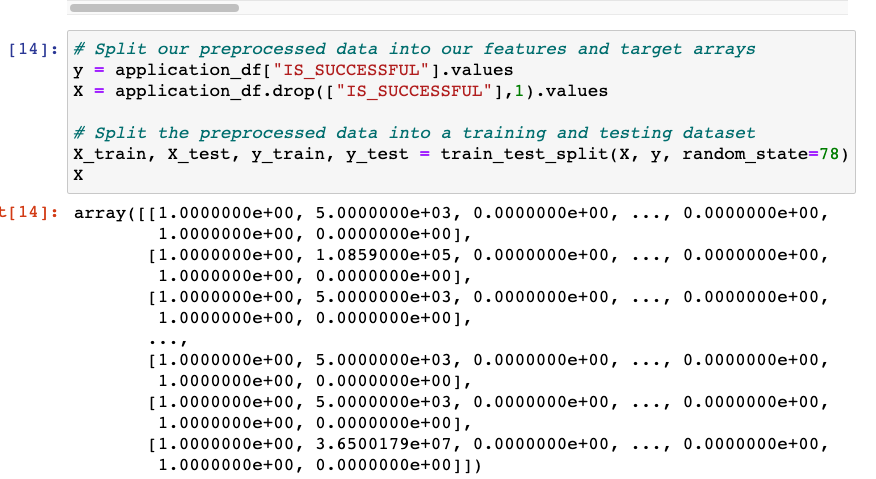
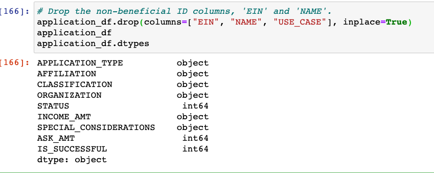
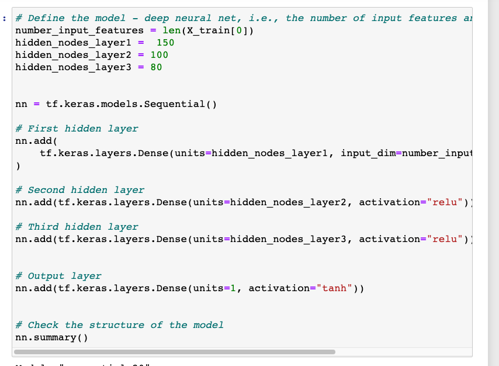

# Neural_Network_Charity_Analysis

# Overview of the analysis

Using the knowledge of machine learning and neural networks,the main purpose of the analysis is to use the features in the provided dataset to create a binary classifier that is capable of predicting whether applicants will be successful if funded by Alphabet Soup.

# Results

As can be seen in, 

### What variable(s) are considered the target(s) for your model?

"IS_SUCCESSFUL" column is considered the target

### What variable(s) are considered to be the features for your model?

Below variables are considered features:

	AFFILIATION	
	CLASSIFICATION		
	ORGANIZATION	
	STATUS	INCOME_AMT	
	SPECIAL_CONSIDERATIONS	
	ASK_AMT

### What variable(s) are neither targets nor features, and should be removed from the input data?

As can be seen in,  below variables are removed from the input data

	EIN	NAME	
	APPLICATION_TYPE	
	USE_CASE

### How many neurons, layers, and activation functions did you select for your neural network model, and why?

As seen in, 

3 hidden layers are selected with 150, 100 and 80 neurons in each layer respectively. "relu" activation function is selected for all hidden layers where as "sigmoid" is selected for output layer. Selecting more neurons or layers than the current selection may overfit the model.

### Were you able to achieve the target model performance?

I wasn't able to achieve the target model performance

### What steps did you take to try and increase model performance?

- Dropped "USE_CASE" column from features
- Increased the number hidden layers to 3
- Increased number of neurons in each layer
- Reduced the epochs to 70

# Summary

In summary, multiple attempts have been made by removing noisy variables, increasing the number of hidden layers, neurons etc to improve the model performance, but target accuracy of over 75% cannot be achieved.

To achieve better performance & target accuracy, I would recommend to use random forest model for it's robustness and scalability and also due to the fact that random forest models can easily handle outliers and nonlinear data.